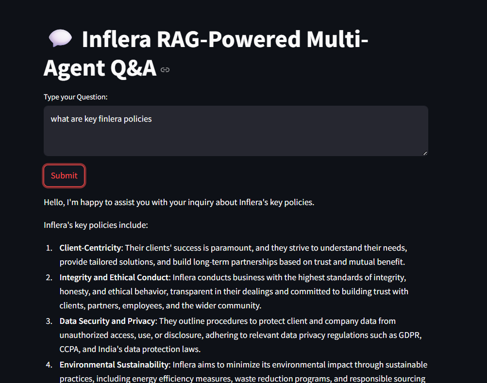
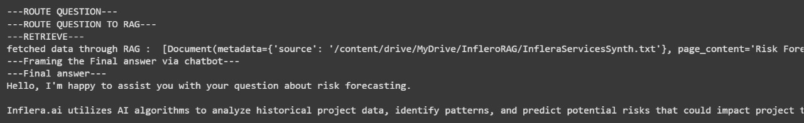

# Inflera RAG-Powered Multi-Agent Q&A System

This project is a multi-agent Q&A chat application built for **Inflera**, leveraging the power of Retrieval-Augmented Generation (RAG) and agentic workflows using `LangGraph`, `LangChain`, and LLMs from **Groq**.

The application is deployed on **Streamlit Cloud** using the `streamlit` CLI, providing users with an intuitive interface to ask questions and receive accurate, context-aware answers.

---

## 🚀 Features

- **Multi-Agent Workflow** using [LangGraph](https://github.com/langchain-ai/langgraph), leveraging its *stateful nature* to create an intelligent routing system.
- Powered by **fast, accurate LLMs via Groq**:
  - `Gemma2-9b-It`: Used as the **router node** for intelligent query dispatching.
  - `LLaMA-3.1-8B-Instant`: Used for **final LLM-based answer generation**, selected for its rapid inference and contextual capabilities.
- Uses **LangChain** to orchestrate agents and tools.
- Hybrid retrieval approach using:
  - **RAG Node** (for document-grounded answers)
  - **Wikipedia API**
  - **Tavily Internet Search**
- Dynamically routes questions to the most relevant tool based on input content.
- All logs are **securely stored and accessible** via:
  - **Streamlit Cloud Console logs**
  - **Local terminal**
  > 🔒 Logs are not displayed in the Streamlit Web CLI due to platform limitations but are not lost.

---

## 🧠 Agentic Workflow Structure

Below is a diagram representing the structure of the multi-agent workflow using LangGraph.


**Workflow Steps**:
1. **User Input**
2. **Router Node (Gemma2-9b-It)** → Determines query intent
3. Routes to:
   - **RAG Node** (internal knowledge base)
   - **Wikipedia Tool**
   - **Tavily Internet Search**
4. **LLM Invocation (LLaMA-3.1-8B-Instant)** → Generates final answer
5. **Streamlit Chat Interface** displays the output

---

## 📂 Project Structure

```
├── app.py                   # Streamlit app entry point
├── requirements.txt         # Dependencies
├── README.md
├── Rag/
│   ├── InfleraServicesSynth.txt
│   ├── WorkPrinciples-synthesized.txt
│   ├── mainInflera.txt
```

---

## 📸 Demo

Showcasing key features of the chat system and its capabilities:




---

## 🚀 How to Run

### Local Development

```bash
pip install -r requirements.txt
streamlit run app.py
```

### Streamlit Cloud Deployment

```bash
streamlit deploy
```

> Note: Logging output is visible in the **Streamlit Cloud Console** and your **local terminal**, but not in the browser CLI.

---
## 🌐 Live Demo

👉 [Check out the live app on Streamlit Cloud]([https://your-streamlit-app-url](https://inflera-assignment-chirag7.streamlit.app/))


## 🧰 Tech Stack

- **LangGraph**: Stateful agent orchestration
- **LangChain**: Agent tools and chains
- **Groq LLMs**:
  - `Gemma2-9b-It` (router)
  - `LLaMA-3.1-8B-Instant` (response generation)
- **Streamlit**: Frontend and deployment
- **Wikipedia & Tavily**: External data sources

---

## 🧪 Future Work

- Improve prompt engineering for better tool routing
- Implement feedback collection system
- Add session history for chat continuity
- Fallback to hybrid tools in case of source failures

---

## 🙌 Acknowledgements

Thanks to [Inflera](https://inflera.com) for this exciting opportunity to build a real-world AI-powered agentic system using cutting-edge technologies in NLP, retrieval, and conversational AI.

---

